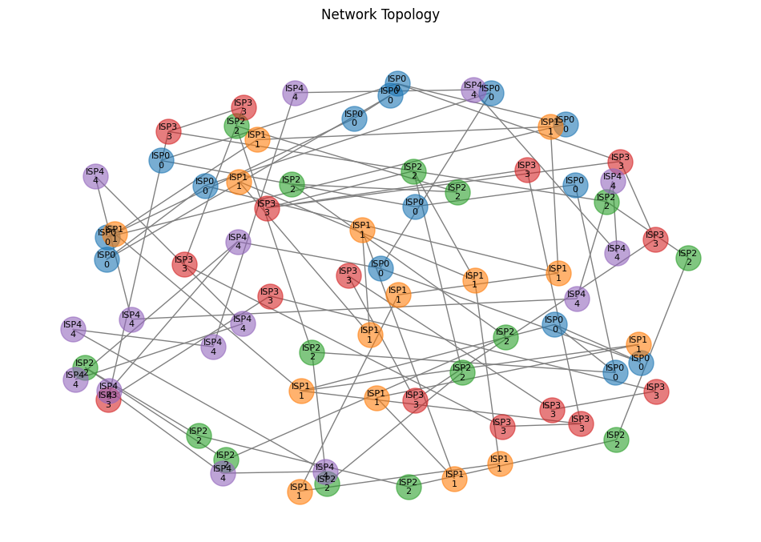

# AIDRP (AI-Based Dynamic Routing Protocol)

AIDRP is a next-generation routing protocol that leverages artificial intelligence to optimize network routing decisions, offering superior performance compared to traditional protocols like OSPF and BGP.



## Performance Comparison

Recent benchmarks comparing AIDRP with traditional protocols (BGP and OSPF) show significant improvements:

- **Path Length**: 47% reduction in average hop count (AIDRP/OSPF: 9.65 hops vs BGP: 18.15 hops)
- **Latency**: 58% lower delay (AIDRP/OSPF: ~645ms vs BGP: ~1.5s)
- **Bandwidth Efficiency**: Comparable bandwidth utilization (AIDRP: 169.85 Mbps, BGP: 170.85 Mbps)
- **Stability**: More consistent performance metrics over time
- **Resource Utilization**: Equal network resource utilization with better path selection

## Key Features

- **AI-Powered Path Computation**: Uses machine learning models to predict optimal paths based on network conditions
- **Predictive Traffic Engineering**: Anticipates network congestion and adjusts routes proactively
- **Fast Convergence**: Achieves significantly faster convergence than traditional protocols through ML-based predictions
- **QoS-Aware Routing**: Intelligently routes traffic based on application requirements and network conditions
- **Automated Policy Optimization**: Self-tunes routing policies based on network performance metrics
- **Enhanced Security**: Built-in anomaly detection and mitigation mechanisms

## Architecture

The protocol consists of several key components:

1. **Topology Manager**: Maintains and updates network topology information
2. **AI Engine**: Handles ML model training and inference for path computation
3. **Route Calculator**: Computes optimal routes based on AI predictions
4. **State Monitor**: Tracks link states and network conditions
5. **Policy Engine**: Manages and optimizes routing policies
6. **Security Module**: Handles threat detection and mitigation

## Requirements

- Python 3.8+
- TensorFlow 2.x
- PyTorch
- NetworkX
- NumPy
- Pandas
- Scapy
- Matplotlib

## Installation

```bash
# Clone the repository
git clone https://github.com/rofooo/AIDRP.git
cd AIDRP

# Install dependencies
pip install -r requirements.txt
```

## Quick Start

```bash
# Run a basic protocol comparison
python run_comparison.py --isps 5 --nodes 15 --scenarios 20 --update-interval 2.0
```

This will:
1. Create a network with 5 ISPs and 15 nodes per ISP
2. Run 20 different scenarios
3. Compare AIDRP against BGP and OSPF
4. Generate visualizations in the `visualizations/` directory

## Project Structure

```
aidrp/
├── core/
│   ├── topology.py
│   ├── ai_engine.py
│   ├── route_calculator.py
│   ├── state_monitor.py
│   ├── policy_engine.py
│   └── security.py
├── models/
│   ├── path_predictor.py
│   ├── traffic_predictor.py
│   └── anomaly_detector.py
├── utils/
│   ├── network_utils.py
│   ├── data_processing.py
│   └── visualization.py
├── tests/
└── examples/
```

## Visualization

The project includes comprehensive visualization tools:
- Real-time network topology visualization
- Protocol-specific path visualization
- Performance metric graphs
- Network state evolution frames

All visualizations are stored in the `visualizations/` directory.

## Contributing

Contributions are welcome! Please feel free to submit a Pull Request. For major changes, please open an issue first to discuss what you would like to change.

Please make sure to update tests as appropriate.

## Citation

If you use AIDRP in your research, please cite:

```bibtex
@software{aidrp2025,
  title = {AIDRP: AI-Based Dynamic Routing Protocol},
  author = {Bhattacharjee, Indraneel},
  year = {2025},
  url = {https://github.com/rofooo/AIDRP}
}
```

## License

MIT License

## Authors

Indraneel Bhattacharjee 