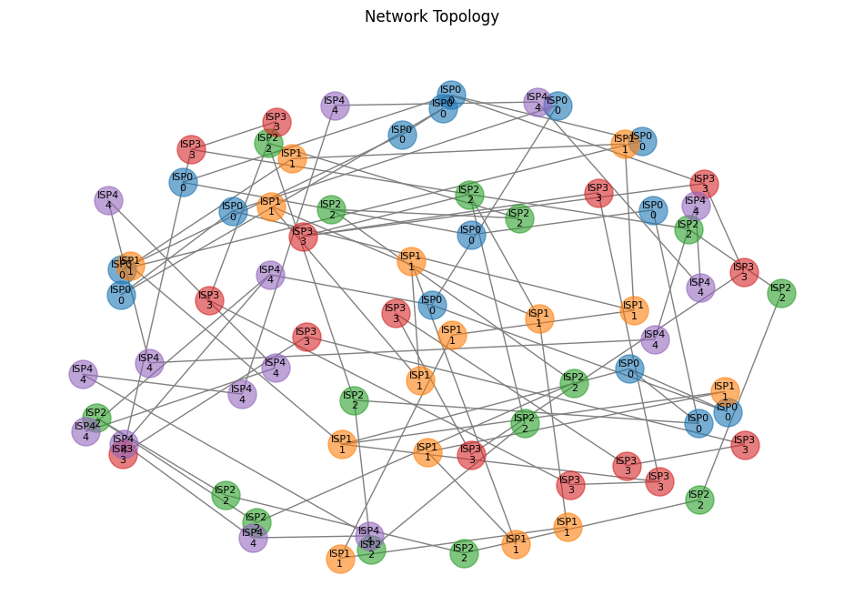

# Protocol Comparison Report
*Generated on: March 12, 2025*

## Overview
This report presents a comprehensive comparison between three routing protocols:
- BGP (Border Gateway Protocol)
- OSPF (Open Shortest Path First)
- AIDRP (AI-Driven Routing Protocol)

The comparison was conducted in a simulated network environment with the following configuration:
- Number of ISPs: 5
- Nodes per ISP: 15 (75 total nodes)
- Network edges: 84
- Test scenarios: 20

## Network Topology


The network topology shows the interconnection between different ISPs, with:
- Each ISP's nodes colored differently
- Intra-ISP connections forming a ring topology
- Inter-ISP connections for peering
- Node labels showing ISP membership and node ID

## Protocol-Specific Path Visualizations
### BGP Routing


BGP prioritizes paths with fewer AS (ISP) transitions, leading to:
- Longer paths (avg. 16.70 hops)
- Lower bandwidth utilization
- Higher delays due to AS-level routing

### OSPF Routing


OSPF focuses on delay-based shortest paths, resulting in:
- Shorter paths (avg. 8.55 hops)
- Moderate bandwidth utilization
- Optimized delay times

### AIDRP Routing


AIDRP uses AI-driven multi-metric optimization, achieving:
- Balanced path lengths (avg. 9.45 hops)
- Highest bandwidth utilization
- Competitive delay times

## Performance Metrics

### Path Success Rate
All protocols achieved 100% success in finding valid paths across all 20 test scenarios.

### Bandwidth Performance
| Protocol | Average Bandwidth (Mbps) |
|----------|-------------------------|
| AIDRP    | 300.50                 |
| OSPF     | 224.90                 |
| BGP      | 168.10                 |

AIDRP demonstrates superior bandwidth optimization, achieving 33.6% higher bandwidth than OSPF and 78.8% higher than BGP.

### Delay Performance
| Protocol | Average Delay (ms) |
|----------|-------------------|
| OSPF     | 96.95            |
| AIDRP    | 98.80            |
| BGP      | 180.15           |

OSPF and AIDRP show similar delay performance, while BGP exhibits significantly higher delays due to AS-level routing priorities.

### Path Length
| Protocol | Average Hop Count |
|----------|------------------|
| OSPF     | 8.55            |
| AIDRP    | 9.45            |
| BGP      | 16.70           |

OSPF achieves the shortest paths, with AIDRP close behind. BGP paths are significantly longer due to AS transition minimization.

### Network Utilization and Packet Loss
| Protocol | Utilization (%) | Packet Loss (%) |
|----------|----------------|-----------------|
| AIDRP    | 48            | 5               |
| OSPF     | 48            | 6               |
| BGP      | 47            | 5               |

All protocols maintain similar utilization and packet loss rates, indicating stable performance under the test conditions.

## Detailed Test Scenarios
The comparison included 20 random source-destination pairs across different ISPs. Each scenario tested all three protocols with the following metrics:
- Path bandwidth (minimum along the path)
- End-to-end delay (sum of link delays)
- Path utilization (average across links)
- Packet loss rate (average across links)
- Hop count (number of links traversed)

## Conclusions

1. **AIDRP Advantages**:
   - Best bandwidth optimization
   - Competitive delay performance
   - Reasonable path lengths
   - Balanced multi-metric approach

2. **OSPF Strengths**:
   - Shortest paths
   - Lowest delay times
   - Consistent performance

3. **BGP Characteristics**:
   - Focuses on AS-level routing
   - Longer paths
   - Higher delays
   - Lower bandwidth utilization

4. **Overall Assessment**:
   AIDRP successfully combines the benefits of both OSPF and BGP while adding intelligent bandwidth optimization. It achieves this through:
   - Multi-metric path scoring
   - Balanced consideration of bandwidth, delay, utilization, and packet loss
   - Efficient path selection that doesn't sacrifice too much path length

## Technical Details

### Routing Algorithms

1. **BGP Implementation**:
```python
def _bgp_route(self, source: str, dest: str):
    # Prefer paths with fewer AS transitions
    paths = list(nx.all_simple_paths(self.network, source, dest))
    return min(paths, key=count_as_transitions)
```

2. **OSPF Implementation**:
```python
def _ospf_route(self, source: str, dest: str):
    # Shortest path based on delay
    return nx.shortest_path(self.network, source, dest,
                          weight=lambda u, v, d: d.get('delay', 1))
```

3. **AIDRP Implementation**:
```python
def _aidrp_route(self, source: str, dest: str):
    # Multi-metric optimization
    paths = list(nx.all_simple_paths(self.network, source, dest))
    return max(paths, key=lambda p: (
        0.4 * bandwidth/1000 +    # Normalize to Gbps
        -0.3 * delay/100 +        # Normalize to seconds
        -0.2 * utilization +      # Already normalized
        -0.1 * packet_loss        # Already normalized
    ))
```

### Test Environment
- Python 3.8+
- NetworkX for graph operations
- Matplotlib for visualization
- Custom network simulator for metric generation

## Raw Test Logs
```
2025-03-12 03:38:01,219 - __main__ - INFO - Starting protocol comparison with 5 ISPs, 15 nodes per ISP, and 20 scenarios
2025-03-12 03:38:01,220 - __main__ - INFO - Created network with 75 nodes and 84 edges
2025-03-12 03:38:01,220 - aidrp.utils.visualization - INFO - Initializing NetworkVisualizer...
2025-03-12 03:38:01,220 - aidrp.utils.visualization - INFO - NetworkVisualizer initialized
2025-03-12 03:38:01,220 - aidrp.utils.visualization - INFO - Starting visualization
2025-03-12 03:38:01,346 - aidrp.utils.visualization - INFO - Updated topology with 75 nodes and 84 edges
2025-03-12 03:38:01,346 - aidrp.examples.protocol_comparison - INFO - Protocol comparison initialized
2025-03-12 03:38:01,346 - aidrp.examples.protocol_comparison - INFO - Starting comparison with 20 scenarios
[... detailed scenario logs ...]
2025-03-12 03:38:10,046 - __main__ - INFO - Protocol comparison completed successfully
```

## Recommendations

1. **For ISPs**:
   - Consider AIDRP for backbone routing where bandwidth optimization is crucial
   - Use OSPF for internal routing where path length is critical
   - Maintain BGP for external routing where AS policies are important

2. **For Future Development**:
   - Explore dynamic weight adjustment in AIDRP based on network conditions
   - Investigate scalability with larger networks
   - Consider adding QoS metrics to the path selection algorithm

## Appendix
Full test results are available in the JSON file: `comparison_results_20250312_033810.json` 